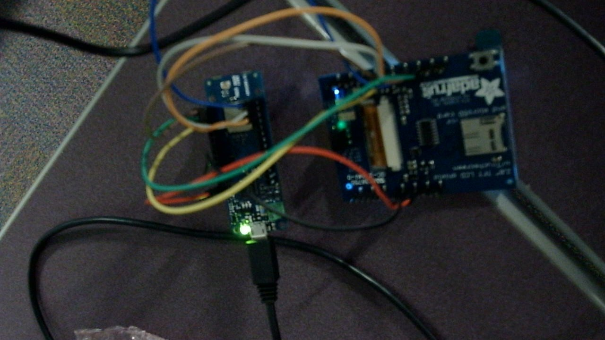

# Tic Tac Toe

Play tic tac toe with another human over LoRa.

## Parts

* 2 [Arduino MKR 1300](https://docs.arduino.cc/hardware/mkr-wan-1300)'s
* 2 [Adafruit touch shields](https://www.adafruit.com/product/1651)
* 2 Antennas

## Libraries

* [LoRa](https://github.com/sandeepmistry/arduino-LoRa)
* [Adafruit ILI9341](https://github.com/adafruit/Adafruit_ILI9341)
* [Adafruit STMPE610](https://github.com/adafruit/Adafruit_STMPE610)
* [Adafruit GFX](https://learn.adafruit.com/adafruit-gfx-graphics-library/overview)

## Wiring

MKR pin 3 -> shield pin 9    
MKR pin 4 -> shield pin 10    
MKR pin 5 -> shield pin 11    
MKR pin 6 -> shield pin 12    
MKR pin 7 -> shield pin 13    
MKR pin 8 -> shield pin 8

